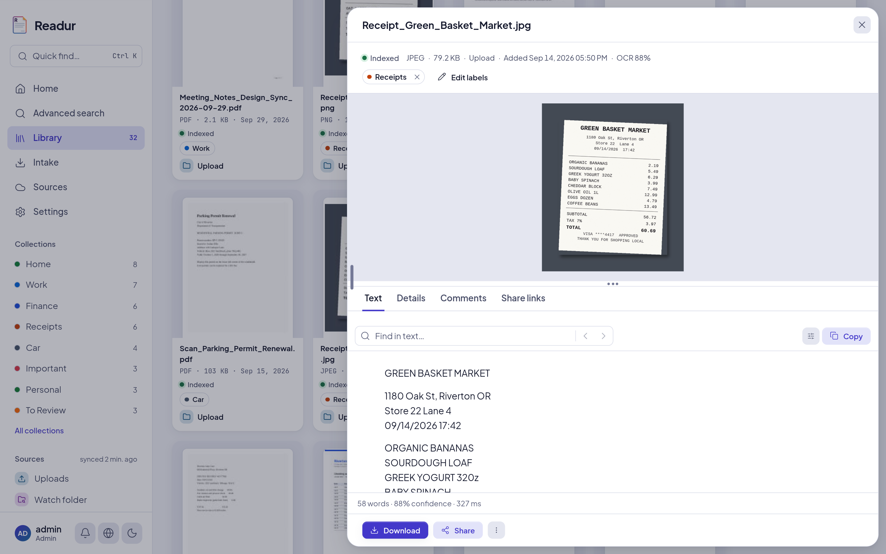
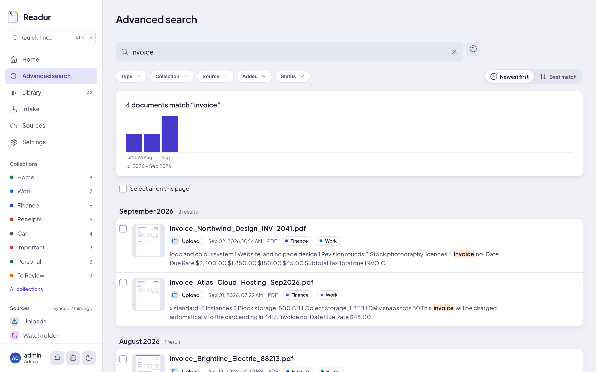

# Readur 📄

Readur is a powerful and modern document management system designed to help individuals and teams efficiently organize, process, and access their digital documents. It combines a high-performance backend with a sleek and intuitive web interface to deliver a smooth and reliable user experience.

You can check our our docs at [docs.readur.app](https://docs.readur.app).




## ✨ Features

| Feature | Description | Documentation |
|---------|-------------|---------------|
| 🔐 **Secure Authentication** | JWT-based user authentication with bcrypt password hashing + OIDC/SSO support | [User Management](https://docs.readur.app/user-management-guide/), [OIDC Setup](https://docs.readur.app/oidc-setup/) |
| 👥 **User Management** | Role-based access control with Admin and User roles | [User Management Guide](https://docs.readur.app/user-management-guide/) |
| 📤 **Smart File Upload** | Drag-and-drop support for PDF, images, text files, and Office documents (DOCX, XLSX, DOC*) | [File Upload Guide](https://docs.readur.app/file-upload-guide/) |
| 🔍 **Advanced OCR** | Automatic text extraction using Tesseract and Office document parsing | [OCR Optimization](https://docs.readur.app/dev/OCR_OPTIMIZATION_GUIDE/) |
| 🌍 **Multi-Language OCR** | Process documents in multiple languages simultaneously with automatic language detection | [Multi-Language OCR Guide](https://docs.readur.app/multi-language-ocr-guide/) |
| 🔎 **Powerful Search** | PostgreSQL full-text search with multiple modes (simple, phrase, fuzzy, boolean) | [Advanced Search Guide](https://docs.readur.app/advanced-search/) |
| 🔗 **Multi-Source Sync** | WebDAV, Local Folders, and S3-compatible storage integration | [Sources Guide](https://docs.readur.app/sources-guide/), [S3 Storage Guide](https://docs.readur.app/s3-storage-guide/) |
| 🏷️ **Labels & Organization** | Comprehensive tagging system with color-coding and hierarchical structure | [Labels & Organization](https://docs.readur.app/labels-and-organization/) |
| 👁️ **Folder Monitoring** | Non-destructive file watching with intelligent sync scheduling | [Watch Folder Guide](https://docs.readur.app/WATCH_FOLDER/) |
| 📊 **Health Monitoring** | Proactive source validation and system health tracking | [Health Monitoring Guide](https://docs.readur.app/health-monitoring-guide/) |
| 🔔 **Notifications** | Real-time alerts for sync events, OCR completion, and system status | [Notifications Guide](https://docs.readur.app/notifications-guide/) |
| 🔌 **Swagger UI** | Built-in interactive API documentation accessible from your profile menu | [Swagger UI Guide](https://docs.readur.app/swagger-ui-guide/) |
| 🎨 **Modern UI** | Beautiful React frontend with Material-UI components and responsive design | [User Guide](https://docs.readur.app/user-guide/) |
| 🐳 **Docker Ready** | Complete containerization with production-ready multi-stage builds | [Installation Guide](https://docs.readur.app/installation/), [Deployment Guide](https://docs.readur.app/deployment/) |
| ⚡ **High Performance** | Rust backend for speed and reliability | [Architecture Documentation](https://docs.readur.app/dev/architecture/) |
| 📊 **Analytics Dashboard** | Document statistics and processing status overview | [Analytics Dashboard Guide](https://docs.readur.app/analytics-dashboard-guide/) |

## 🚀 Quick Start

```bash
# Clone the repository
git clone https://github.com/perfectra1n/readur
cd readur

# Optional: JWT_SECRET signs session tokens. When unset, a key is generated on
# first start and stored in the database. To manage it yourself:
# echo "JWT_SECRET=$(openssl rand -hex 32)" > .env

# Start all services
docker compose up --build -d

# Access the application
open http://localhost:8000
```

**Admin credentials:**
- Username: `admin` (override with `ADMIN_USERNAME`)
- Password: the value of `ADMIN_PASSWORD` if set; otherwise generated on first run and written to a file

If `ADMIN_PASSWORD` is not set, Readur generates a random 24-character password on first startup and writes it to `initial-admin-password` in the `.readur` directory inside `UPLOAD_PATH` (`/app/uploads/.readur/initial-admin-password` in the Docker image), readable only by the server user. The password is not written to the logs; the log line shows the file path. Set `ADMIN_PASSWORD_FILE` to choose a different location.

```bash
docker compose exec readur cat /app/uploads/.readur/initial-admin-password
```

Sign in, change the password, then delete the file.

To reset the admin password later:
```bash
docker compose exec readur readur reset-admin-password
```

## 📚 Documentation

### Getting Started
- [📦 Installation Guide](https://docs.readur.app/installation/) - Docker & manual installation instructions
- [🔧 Configuration](https://docs.readur.app/configuration/) - Environment variables and settings
- [⚙️ Configuration Reference](https://docs.readur.app/configuration-reference/) - Complete configuration options reference
- [📖 User Guide](https://docs.readur.app/user-guide/) - How to use Readur effectively

### Core Features
- [🔗 Sources Guide](https://docs.readur.app/sources-guide/) - WebDAV, Local Folders, and S3 integration
- [☁️ S3 Storage Guide](https://docs.readur.app/s3-storage-guide/) - Complete S3 and S3-compatible storage setup
- [👥 User Management](https://docs.readur.app/user-management-guide/) - Authentication, roles, and administration
- [🏷️ Labels & Organization](https://docs.readur.app/labels-and-organization/) - Document tagging and categorization
- [🔎 Advanced Search](https://docs.readur.app/advanced-search/) - Search modes, syntax, and optimization
- [🌍 Multi-Language OCR Guide](https://docs.readur.app/multi-language-ocr-guide/) - Process documents in multiple languages simultaneously
- [🔐 OIDC Setup](https://docs.readur.app/oidc-setup/) - Single Sign-On integration

### Deployment & Operations
- [🚀 Deployment Guide](https://docs.readur.app/deployment/) - Production deployment, SSL, monitoring
- [🔄 Reverse Proxy Setup](https://docs.readur.app/REVERSE_PROXY/) - Nginx, Traefik, and more
- [📁 Watch Folder Guide](https://docs.readur.app/WATCH_FOLDER/) - Automatic document ingestion
- [🔄 Migration Guide](https://docs.readur.app/migration-guide/) - Migrate from local storage to S3
- [🛠️ S3 Troubleshooting](https://docs.readur.app/s3-troubleshooting/) - Debug and resolve S3 storage issues

### Development
- [🏗️ Developer Documentation](https://docs.readur.app/dev/) - Architecture, development setup, testing
- [🔌 API Reference](https://docs.readur.app/api-reference/) - REST API documentation

### Advanced Topics
- [🔍 OCR Optimization](https://docs.readur.app/dev/OCR_OPTIMIZATION_GUIDE/) - Improve OCR performance
- [🗄️ Database Best Practices](https://docs.readur.app/dev/DATABASE_GUARDRAILS/) - Concurrency and safety
- [📊 Queue Architecture](https://docs.readur.app/dev/QUEUE_IMPROVEMENTS/) - Background job processing
- [⚠️ Error System Guide](https://docs.readur.app/dev/ERROR_SYSTEM/) - Comprehensive error handling architecture

## 🏗️ Architecture

```
┌─────────────────┐    ┌─────────────────┐    ┌─────────────────┐
│   React Frontend │────│   Rust Backend  │────│  PostgreSQL DB  │
│   (Port 8000)   │    │   (Axum API)    │    │   (Port 5433)   │
└─────────────────┘    └─────────────────┘    └─────────────────┘
         │                       │                       │
         │              ┌─────────────────┐             │
         └──────────────│  File Storage   │─────────────┘
                        │  + OCR Engine   │
                        └─────────────────┘
```

## 📋 System Requirements

### Minimum
- 2 CPU cores, 2GB RAM, 10GB storage
- Docker or manual installation prerequisites

### Recommended for Production
- 4+ CPU cores, 4GB+ RAM, 50GB+ SSD
- See [deployment guide](https://docs.readur.app/deployment/) for details

### Optional Dependencies
For legacy Microsoft Word (.doc) file support, install one of:
- `antiword` - Lightweight DOC text extractor
- `catdoc` - Alternative DOC text extraction tool

*Note: Modern Office formats (DOCX, XLSX) are fully supported without additional dependencies.*

## 🤝 Contributing

We welcome contributions! Please see our [Contributing Guide](CONTRIBUTING.md) and [Development Setup](https://docs.readur.app/dev/development/) for details.

## 🔒 Security

- Change default credentials immediately
- Use HTTPS in production
- Regular security updates
- See [deployment guide](https://docs.readur.app/deployment/#security-considerations) for security best practices

## 📝 License

This project is licensed under the MIT License - see the [LICENSE](LICENSE) file for details.

## 🙏 Acknowledgments

- [Tesseract OCR](https://github.com/tesseract-ocr/tesseract) for text extraction
- [Axum](https://github.com/tokio-rs/axum) for the web framework
- [Material-UI](https://mui.com/) for the beautiful frontend components
- [PostgreSQL](https://www.postgresql.org/) for robust full-text search

## Screenshots



## 📞 Support

- **Documentation**: Start with the [User Guide](https://docs.readur.app/user-guide/)
- **Issues**: Report bugs on [GitHub Issues](https://github.com/readur/readur/issues)
- **Discussions**: Join our [GitHub Discussions](https://github.com/readur/readur/discussions)

---

**Made with ❤️ and ☕ by the Readur team**


