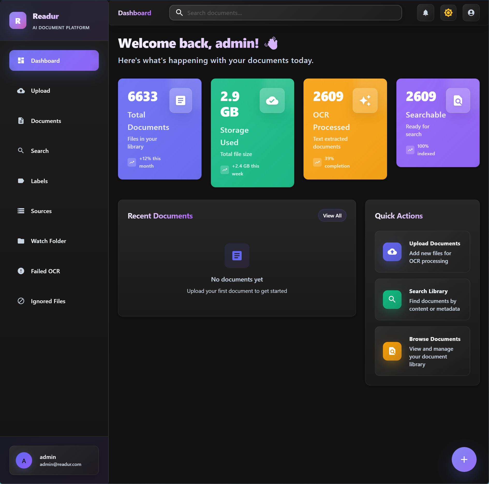
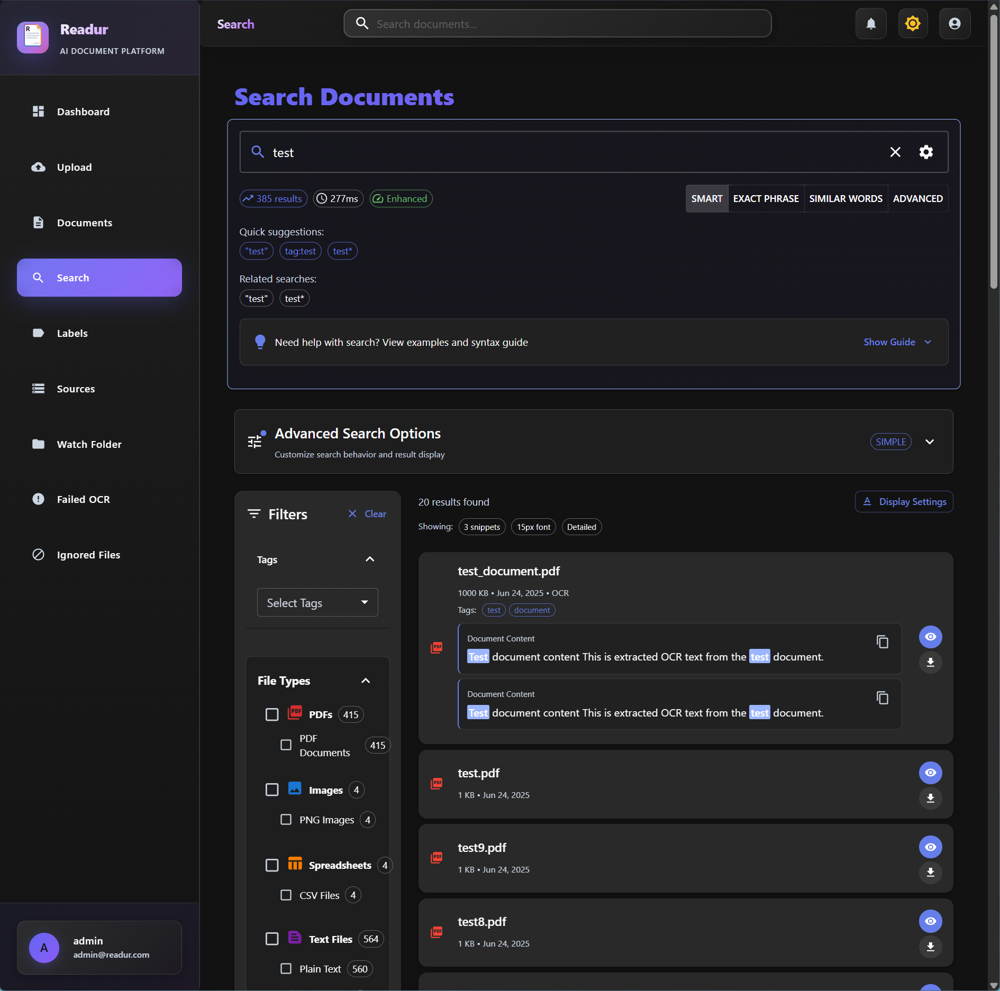
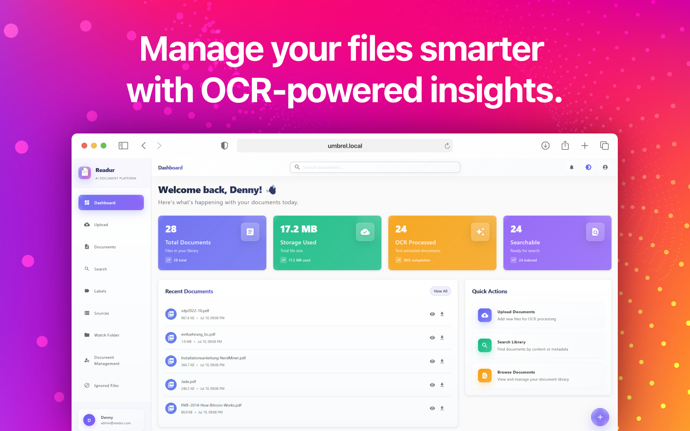
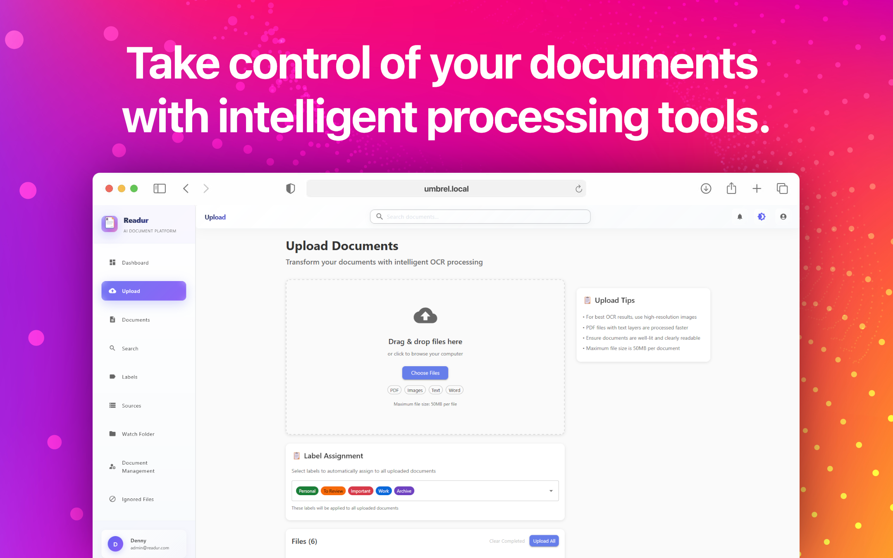
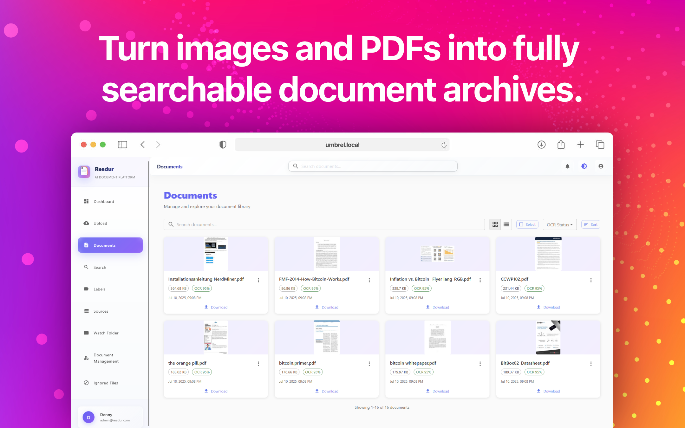
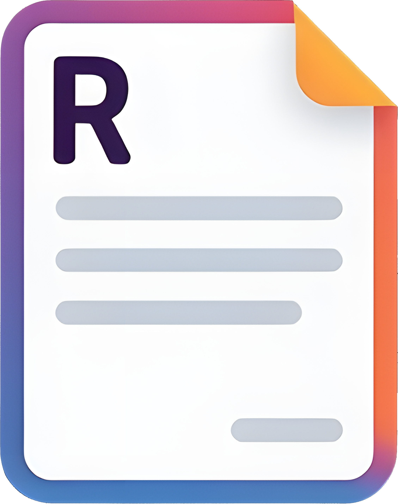
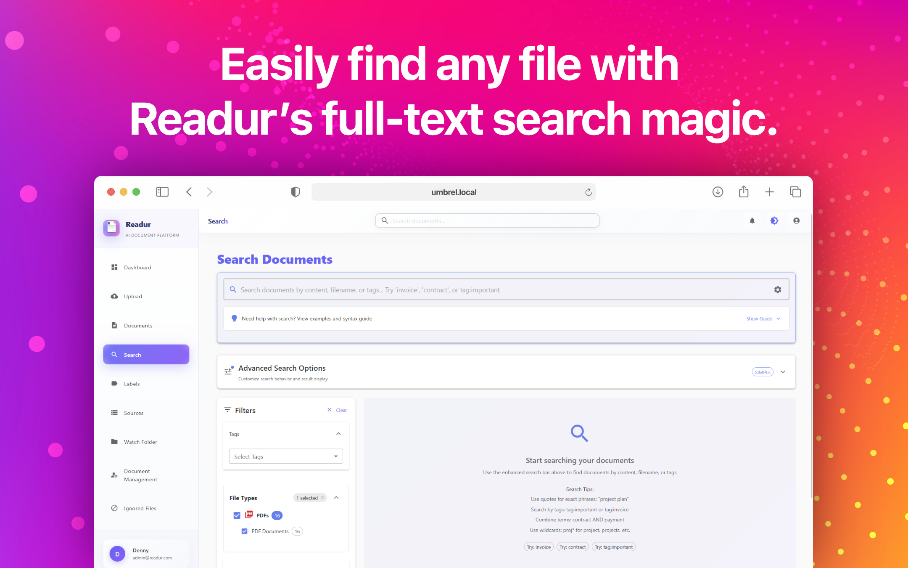
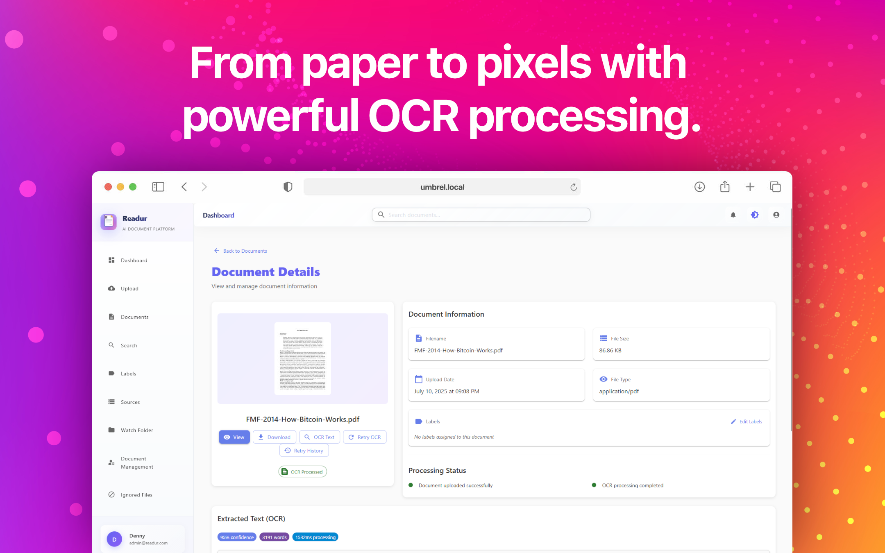
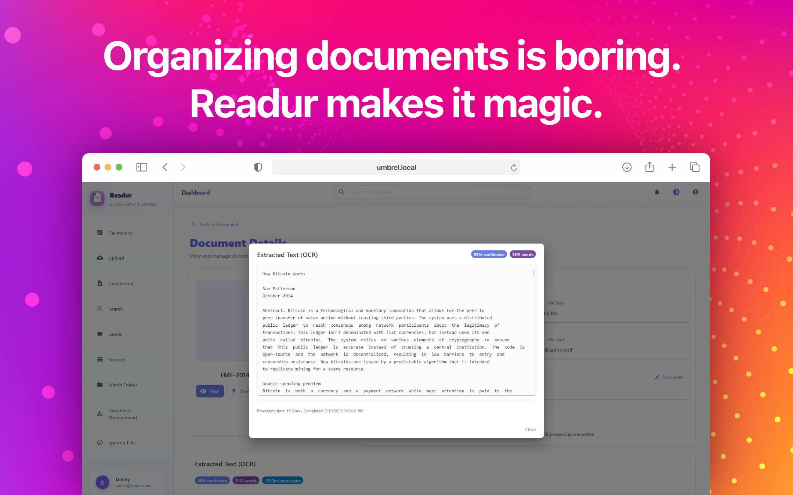

# Gallery

Explore Readur's intuitive interface and powerful features through these screenshots. Each image showcases different aspects of the system, from document management to advanced search capabilities.

## Dashboard Overview

The main dashboard provides a comprehensive view of your document library. The clean, modern interface displays documents in an organized grid layout with thumbnails for quick visual identification. The left sidebar offers easy access to navigation, labels, and sources, while the top bar provides quick actions for uploading, searching, and managing your documents. Notice the document statistics at the top showing total documents, processing status, and storage usage.

## Advanced Search Interface

Readur's search capabilities go far beyond simple keyword matching. This view demonstrates the advanced search interface where you can combine multiple criteria, use boolean operators, and filter by document properties. The search results display instantly with highlighted matching terms, making it easy to identify relevant documents. The faceted filtering on the left allows you to further refine results by date, document type, labels, and OCR status.

## Document Processing & OCR

Watch as Readur processes your documents in real-time. This screen shows the OCR queue in action, with documents being analyzed and converted to searchable text. The progress indicators and status updates keep you informed about processing status. Each document shows its current state - queued, processing, or completed - along with relevant metadata like language detection results and processing time.

## Label Management System

The label management interface demonstrates Readur's flexible organizational capabilities. Create hierarchical label structures with custom colors for visual distinction. Documents can have multiple labels applied, enabling multi-dimensional categorization that goes beyond traditional folder structures. The drag-and-drop interface makes it simple to reorganize your label hierarchy as your needs evolve.

## Source Configuration

Configure multiple document sources to automatically sync with Readur. This interface shows the source configuration panel where you can set up connections to WebDAV servers, S3-compatible storage, or local folders. Each source can have its own sync schedule, filters, and processing rules. The health monitoring indicators show the status of each source, ensuring your documents are always up to date.

## Document Detail View

The document detail view provides comprehensive information about individual documents. View the original document alongside its extracted text, manage labels, see processing history, and access document metadata. The split-pane interface allows you to review the original document while searching within its extracted text. Quick actions for downloading, sharing, or reprocessing are readily accessible.

## Analytics Dashboard

Track your document management metrics with the analytics dashboard. Visualize document growth over time, processing statistics, storage usage trends, and search patterns. The interactive charts help you understand how your document library is being used and identify opportunities for optimization. Export reports for compliance or audit purposes with a single click.

## User Management

The administration panel provides comprehensive user management capabilities. Create and manage user accounts, assign roles and permissions, configure authentication methods including OIDC/SSO integration, and monitor user activity. The interface clearly shows user status, last login times, and document access patterns, making it easy to maintain security and compliance.

## Mobile Responsive Design

Readur's responsive design ensures full functionality on mobile devices. Access your documents, perform searches, and manage your library from smartphones and tablets. The touch-optimized interface adapts to smaller screens without sacrificing features. Swipe gestures, pinch-to-zoom on documents, and streamlined navigation make mobile document management effortless.

## Getting Started

Ready to transform your document management? Check out our [Quick Start Guide](quickstart/docker.md) to get Readur running in minutes, or explore the [User Guide](user-guide.md) for detailed instructions on using all these features.

### Key Interface Elements

Throughout Readur's interface, you'll notice consistent design patterns that make navigation intuitive:

- **Action buttons** are prominently displayed and color-coded for quick identification
- **Status indicators** use clear icons and colors to communicate document states
- **Contextual menus** provide relevant actions based on your current selection
- **Keyboard shortcuts** are available for power users who prefer efficient navigation
- **Dark mode support** reduces eye strain during extended use sessions

### Customization Options

Readur's interface can be customized to match your workflow:

- Choose between list and grid views for document display
- Configure which columns appear in list view
- Set your preferred sort order and filtering defaults
- Customize the sidebar to show your most-used sections
- Adjust thumbnail sizes in grid view for optimal density

The gallery images above represent just a fraction of Readur's capabilities. The system is designed to grow with your needs, from personal document management to enterprise-scale deployments handling millions of documents.