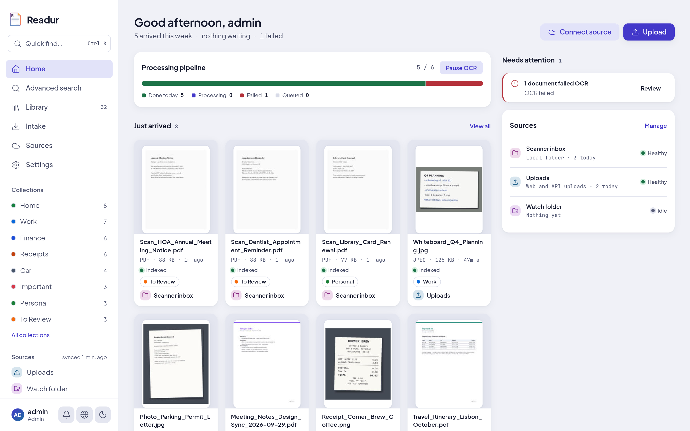
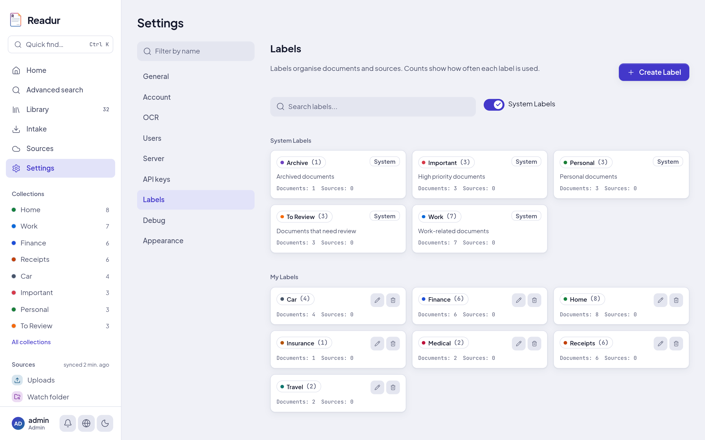
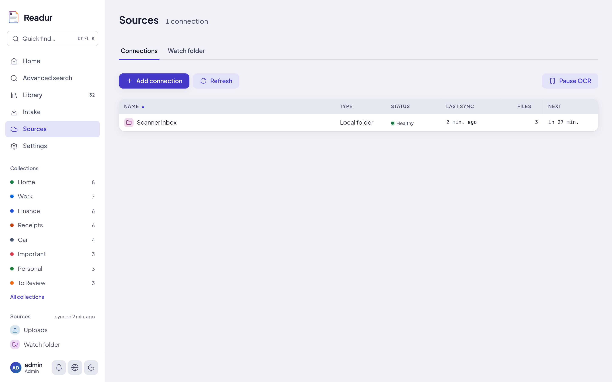
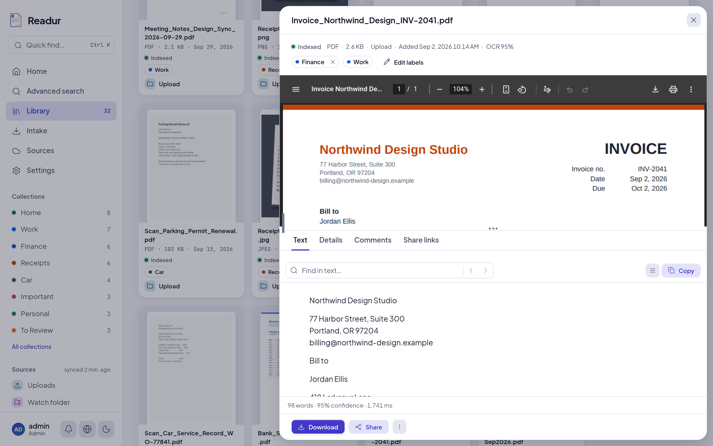
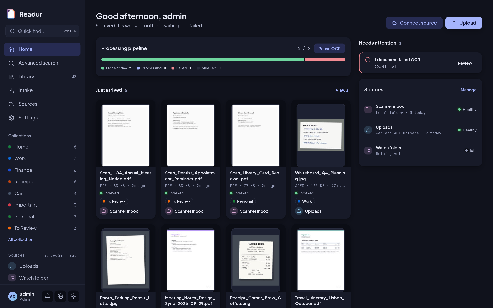
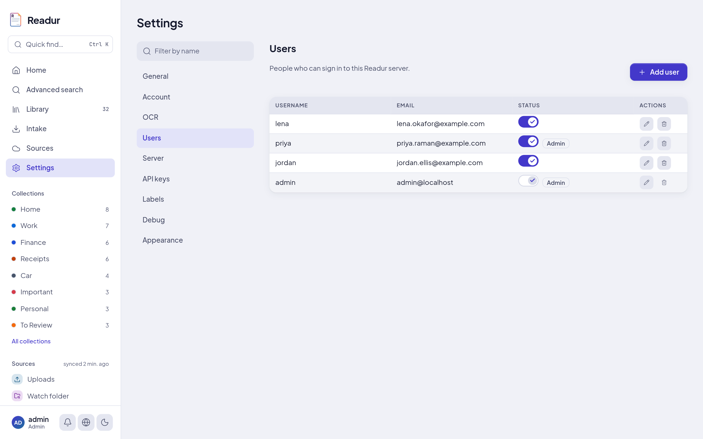
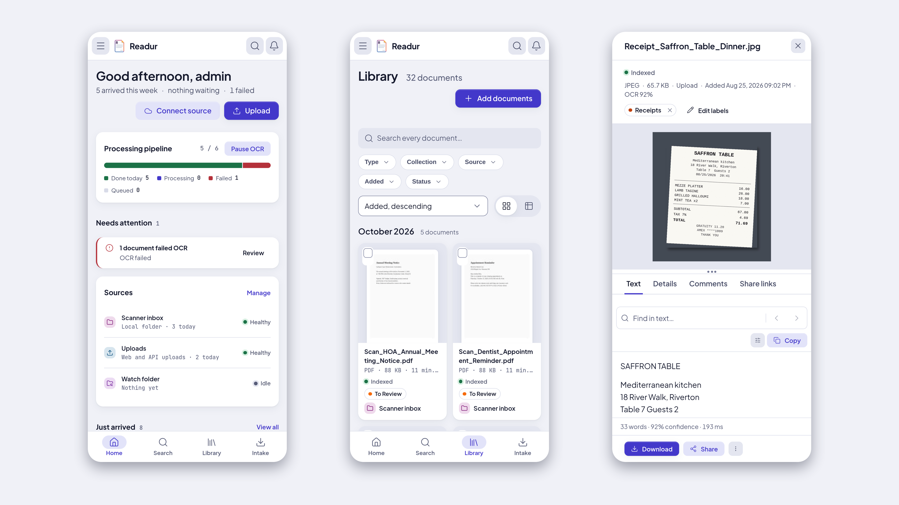

# Gallery

A tour of Readur's interface. Every screenshot uses sample documents, and all names, companies and numbers in them are made up.

## Home

Home shows what needs you at a glance: the processing pipeline with today's done, failed and queued counts, anything that needs attention (such as a document OCR couldn't read), the health of each source, and the documents that just arrived. The sidebar holds the destinations, your collections with their counts, and your sources.

## Advanced Search

Search reads the text of every document, including scanned images and photos, and shows the matching passage with your words highlighted. Filter by type, collection, source, date added and OCR status, sort by newest or best match, and use the timeline to narrow the results to the months you care about. A search can be saved as a collection.

## The Library and the Document Drawer

The Library shows every document as a thumbnail grouped by month, or as a dense table. Opening a document slides in a drawer over the page: its status and facts, its labels, the file itself, and the extracted text with find. The drawer lives in the URL, so a link opens it straight away, the browser's Back button closes it, and ↑/↓ moves through the list.

## Collections and Labels

Labels group documents into collections across folders and sources. Give each one a colour, apply several to a document, and find them in the sidebar with their counts. Readur ships with a few system labels such as Important and To Review.

## Sources

Connect WebDAV servers (Nextcloud, ownCloud), S3-compatible storage or local folders, and Readur imports new files on a schedule. Each connection shows its health, when it last synced, how many files it brought in and when it syncs next.

## Document Details

PDFs open in the browser's own viewer inside the drawer, above tabs for the extracted text, the details (file, source, processing history and metadata), comments and share links. Drag the dotted handle between the file and the tabs to give either one more room. Download, share, retry OCR or delete from the bar along the bottom.

## Dark Mode

Light and dark themes are designed together, and Readur follows your system setting unless you choose one in the sidebar.

## User Management

Administrators add people, set their roles, and turn accounts on or off. Readur also supports OIDC single sign-on.

## On Your Phone

On a phone, Readur becomes a tab bar with the main destinations, and documents open full screen with the same tabs and actions as on the desktop.

## Getting Started

Ready to try it? The [Quick Start Guide](quickstart/docker.md) gets Readur running in minutes, and the [User Guide](user-guide.md) covers everything shown here in detail.
