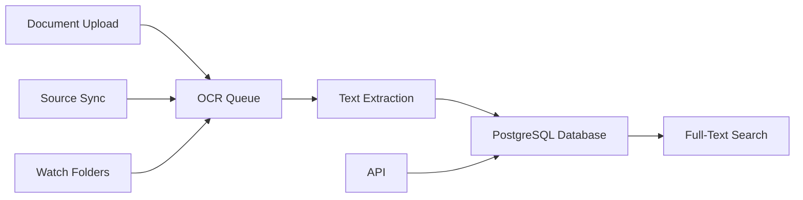

# Readur Documentation

## Intelligent Document Management with OCR

Readur is a powerful document management system that transforms your unstructured documents into a searchable, organized knowledge base. Built for teams and individuals who need to efficiently manage, search, and access large document collections.

## Key Capabilities

<div class="grid cards" markdown>

- **[Getting Started](getting-started/installation.md)**  
  Deploy Readur with Docker in minutes - single command setup

- **[User Guide](user-guide.md)**  
  Master document management, OCR processing, and search features

- **[API Reference](api-reference.md)**  
  Automate workflows with REST API integration

- **[Deployment Guide](deployment.md)**  
  Production deployment with SSL, monitoring, and scaling

</div>

## Core Features

### Document Processing
- **Automatic OCR**: Extract text from scanned PDFs and images in 100+ languages
- **Multiple Formats**: Support for PDF, PNG, JPG, TIFF, TXT, and Office documents
- **Batch Processing**: Upload and process hundreds of documents simultaneously
- **Smart Queue**: Priority-based OCR processing with configurable concurrency

### Search & Discovery
- **Full-Text Search**: Find content within documents instantly
- **Advanced Filtering**: Search by date, type, size, labels, and OCR status
- **Boolean Operators**: Complex queries with AND, OR, NOT logic
- **Fuzzy Matching**: Handle typos and OCR errors automatically

### Organization
- **Flexible Labels**: Create custom taxonomies for document categorization
- **Bulk Operations**: Apply changes to multiple documents at once
- **Smart Collections**: Saved searches that update automatically
- **Multiple Views**: List and grid layouts with customizable sorting

### Integration & Automation
- **Source Synchronization**: Auto-import from WebDAV, S3, and local folders
- **REST API**: Complete programmatic access for automation
- **Watch Folders**: Monitor directories for automatic document ingestion
- **SSO Support**: Enterprise authentication with OIDC/OAuth2

## Quick Start Example

```bash
# 1. Clone the repository
git clone https://github.com/readur/readur.git
cd readur

# 2. Start with Docker Compose
docker-compose up -d

# 3. Access the interface
open http://localhost:8000

# Default credentials: admin / readur2024
```

## Common Use Cases

### Digital Archives
Convert paper documents into searchable digital archives. Perfect for:
- Legal firms managing contracts and case files
- Medical practices digitizing patient records
- Government agencies preserving historical documents
- Libraries and research institutions

### Business Document Management
Streamline document workflows and compliance:
- Invoice and receipt processing
- Contract management and search
- Policy and procedure documentation
- Compliance document tracking

### Personal Knowledge Base
Organize personal documents and research:
- Academic papers and research notes
- Tax documents and financial records
- Technical documentation and manuals
- Personal correspondence and archives

## System Architecture



## Performance & Scalability

- **Concurrent Processing**: Handle multiple OCR jobs in parallel
- **Efficient Storage**: S3-compatible backend for unlimited scaling
- **PostgreSQL**: Enterprise-grade database with full-text search
- **Docker Native**: Container-based architecture for easy deployment
- **Resource Management**: Configurable memory and CPU limits

## Getting Help

### Documentation

- [User Guide](user-guide.md)  
  Complete feature documentation
  
- [Configuration Reference](configuration-reference.md)  
  All environment variables
  
- [Troubleshooting](s3-troubleshooting.md)  
  Common issues and solutions
  
- [Migration Guide](migration-guide.md)  
  Upgrade and migration procedures

### Community & Support

- [GitHub Issues](https://github.com/readur/readur/issues)  
  Bug reports and feature requests
  
- [GitHub Discussions](https://github.com/readur/readur/discussions)  
  Community help
  
- [Developer Documentation](dev/)  
  Architecture and development setup

## Latest Updates

### Version 2.5.4
- S3 storage backend support for unlimited scaling
- Enhanced source synchronization with health monitoring
- Improved OCR performance and accuracy
- OIDC/SSO authentication support
- Advanced search with boolean operators

---

!!! tip "Production Ready"
    Readur is actively used in production environments processing millions of documents. See our [Deployment Guide](deployment.md) for best practices.