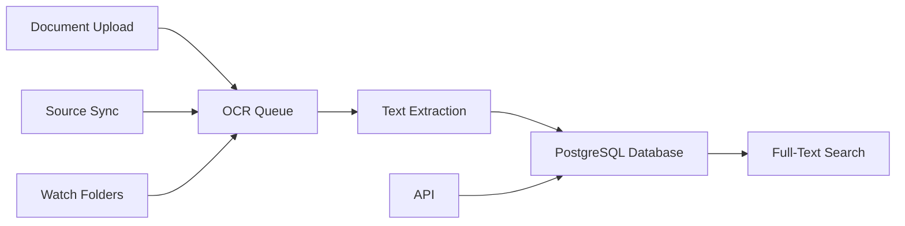

# Readur Documentation

Welcome to Readur, a document management system designed to help you organize, search, and access your documents efficiently. Whether you're managing personal files or handling documents for your organization, Readur transforms scattered papers and digital files into a searchable, well-organized system.

## Quick Start Guides

<div class="grid cards" markdown>

- **[Self-Hosting Guide](self-hosting/index.md)**  
  Complete guide for running Readur on your own infrastructure

- **[Docker Quick Start](quickstart/docker.md)**  
  Get Readur running with Docker in 5 minutes

- **[User Guide](user-guide.md)**  
  Learn to use Readur's document management features

- **[API Documentation](api-reference.md)**  
  Integrate Readur with your applications

</div>

## What Makes Readur Different

### Automatic Text Extraction from Any Document

Upload any document and Readur will extract the text for you. Scanned PDFs, smartphone photos of receipts, old contracts, images - if there's text in it, Readur can find and index it. The OCR engine works with over 100 languages and automatically detects what language your documents are in.

When you upload documents, they're processed through a smart queue system. Smaller files get processed first, usually within seconds, while larger batches work in the background. You can upload hundreds of documents at once without worrying about overwhelming the system.

Readur supports all the document types you actually use: PDFs, images (PNG, JPG, TIFF), text files, and Microsoft Office documents. No need to convert anything beforehand - just upload and let Readur handle the rest.

### Search That Understands How You Think

Finding documents shouldn't feel like solving a puzzle. Readur's search is designed around how you naturally think about your files.

The search engine delivers results in milliseconds, even when you have thousands of documents. You can search with simple keywords, exact phrases (using quotes), or handle typos with fuzzy matching - especially useful when OCR isn't perfect. For complex searches, use boolean queries like "invoice AND (2024 OR 2025) NOT paid" to find exactly what you need.

Filter your results by date, document type, file size, or custom labels you've created. The fuzzy matching is particularly helpful with scanned documents - search for "receipt" and find documents even when the OCR read it as "rec3ipt".

Save your frequently used searches as Smart Collections. These automatically update as you add new documents, so you set up the search once and relevant documents appear there automatically.

### Flexible Organization Without the Complexity

Start with simple document uploads and add organization as you need it. Readur grows with your requirements instead of forcing you into a complex system from day one.

Use labels to categorize your documents. Unlike traditional folders, documents can have multiple labels, so a document can be both "Finance" and "2024" and "Important" at the same time. Create hierarchical labels like "Finance/Invoices/2024" or keep it simple with single tags. Add custom colors to labels so you can spot categories at a glance.

When you need to manage multiple documents at once, use bulk operations. Select several documents and apply labels, trigger reprocessing, export, or delete them all together. The system supports both mouse selection and keyboard shortcuts for efficient work.

View your documents as a detailed list with sortable columns, or switch to grid view to see thumbnails when you need visual identification. Both views give you the same search and filtering capabilities.

### Connects to Your Existing Systems

Readur works with the tools and storage you already use, rather than forcing you to change your workflow.

Sync documents from wherever they currently live. Connect to WebDAV servers (like Nextcloud or ownCloud), mount S3 buckets or compatible storage services, or monitor local directories and network shares. Each source syncs on its own schedule with configurable filters and processing rules.

Set up watch folders to automatically import documents as they're added. Drop files into a watched directory and they'll be imported, processed, and indexed automatically. Your original files can stay where they are - Readur just maintains a searchable copy.

Use the REST API to integrate Readur with your applications and automation scripts. Upload documents, search, manage labels, and retrieve results programmatically. The built-in Swagger UI lets you test API endpoints directly from your browser.

For organizations with existing authentication systems, Readur supports OIDC/OAuth2 single sign-on with providers like Keycloak, Auth0, or Microsoft Azure AD, while maintaining its own role-based access control.

### Built for Performance and Reliability

Readur uses Rust for the backend and React for the frontend, providing the performance and reliability you need for production use.

The Rust backend handles concurrent processing efficiently and safely, maintaining consistent performance whether you're processing 10 documents or 10,000. The async runtime manages multiple operations simultaneously without the overhead of traditional threading.

PostgreSQL provides a solid foundation with ACID compliance for data integrity and powerful full-text search capabilities that scale with your document collection. The database schema is optimized for common query patterns without over-indexing that could slow down document uploads.

Deployment uses a Docker-first approach for consistency across development and production environments. The containerized architecture simplifies deployment and updates while keeping services properly isolated for security.

You can tune Readur for your specific hardware by configuring OCR concurrency based on your CPU cores, setting memory limits for containers, and adjusting database connection pools. Built-in health monitoring endpoints integrate with tools like Prometheus and Grafana.

## Get Started in 5 Minutes

Ready to try Readur? Here's the fastest way to get it running:

```bash
# Clone the repository
git clone https://github.com/readur/readur.git
cd readur

# Start all services
docker-compose up -d

# Open Readur in your browser
open http://localhost:8000
```

Check the container logs (`docker compose logs readur`) for your auto-generated admin password - look for "READUR ADMIN USER CREATED" and save the password immediately. Log in with username `admin` and your generated password, then upload a document and watch Readur extract the text automatically.

## How People Use Readur

### Going Paperless
Many organizations use Readur to digitize their paper documents and create searchable archives. Legal firms scan contracts and case files, medical practices digitize patient records, and government agencies preserve historical documents. Libraries and research institutions use it to make their collections searchable.

### Business Document Management
Companies streamline their document workflows with Readur. Process invoices and receipts automatically, manage contracts with full-text search, maintain searchable policy and procedure documentation, and track compliance documents across departments.

### Personal Organization
Individuals create their own digital knowledge base by organizing academic papers and research notes, maintaining searchable tax and financial records, storing technical documentation and manuals, and preserving personal correspondence and family archives.

## How Readur Works

When you upload a document, it goes into a processing queue where OCR extracts any text. That text gets stored in a PostgreSQL database with full-text search indexes. Documents can come from manual uploads, synchronized sources like WebDAV or S3, or watch folders that automatically import new files.



The system handles multiple OCR jobs in parallel and stores documents on S3-compatible storage for unlimited scaling. The Docker-based architecture makes deployment straightforward, and you can configure memory and CPU limits to match your hardware.

## Choose Your Path

### Want to Try Readur Quickly?
Use the [Docker Quick Start](quickstart/docker.md) to get Readur running in 5 minutes with Docker Compose. This is the fastest way to see what Readur can do.

### Planning a Production Deployment?
The [Self-Hosting Guide](self-hosting/index.md) covers everything you need for production deployment: backup strategies, performance optimization, SSL setup, and monitoring.

### Building or Contributing to Readur?
The [Development Quick Start](quickstart/development.md) helps you set up a development environment and understand the codebase if you want to contribute or customize Readur.

## Find What You Need

### Essential Documentation

**[User Guide](user-guide.md)** - Learn how to use Readur's features for document management, search, and organization

**[Self-Hosting](self-hosting/index.md)** - Complete guide for deploying and maintaining Readur on your infrastructure

**[API Reference](api-reference.md)** - REST API documentation for integrations and automation

**[Administration](administration/cli-tools.md)** - System administration tools and maintenance procedures

### Get Help and Contribute

**[GitHub Issues](https://github.com/readur/readur/issues)** - Report bugs or request new features

**[GitHub Discussions](https://github.com/readur/readur/discussions)** - Get help from the community

**[Development Guide](dev/README.md)** - Contribute to Readur's development

## What's New in Version 2.5.4

This version brings significant improvements to scalability and integration:

- **S3 Storage Support** - Store documents on S3-compatible services for unlimited scaling
- **Enhanced Source Sync** - Better monitoring and health checks for external sources  
- **Improved OCR** - Faster processing and better accuracy for text extraction
- **Enterprise Authentication** - OIDC/SSO support for single sign-on integration
- **Advanced Search** - Boolean operators for complex search queries

---

!!! tip "Production Ready"
    Organizations are using Readur in production to process millions of documents. See the [Deployment Guide](deployment.md) for best practices.